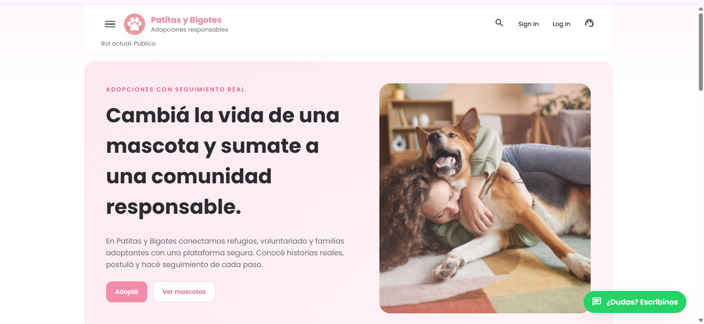
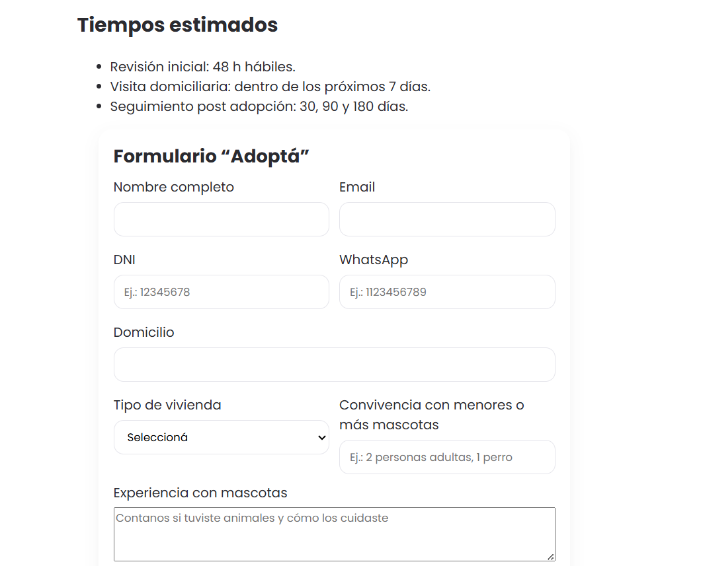
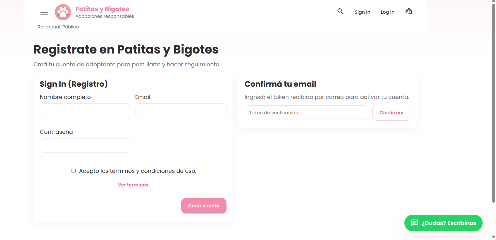
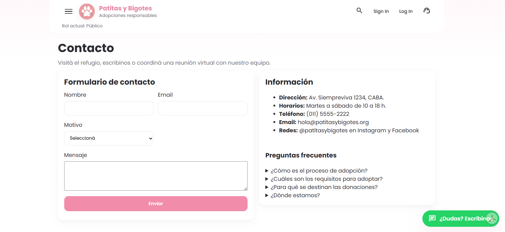
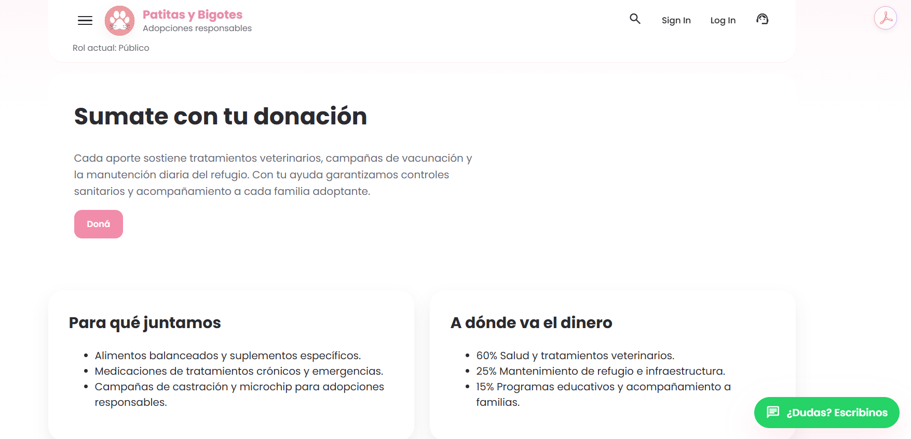

# Patitas y Bigotes

**Aplicación web Full Stack para la gestión integral del rescate, atención sanitaria y adopción de animales.**

Proyecto académico desarrollado en equipo que integra frontend, backend, autenticación por roles, API REST, persistencia en base de datos relacional, testing automatizado y configuración para despliegue.

**Stack principal:** HTML · CSS · JavaScript · Python · Flask · SQLite · REST APIs · Pytest · GitHub Actions

---

## Vista de la aplicación

### Página principal

<p align="center">
  
</p>

### Principales pantallas

<table>
  <tr>
    <td width="50%" align="center">
      <strong>Proceso de adopción</strong>
      <br><br>
      
    </td>
    <td width="50%" align="center">
      <strong>Registro de usuarios</strong>
      <br><br>
      
    </td>
  </tr>
  <tr>
    <td width="50%" align="center">
      <strong>Contacto y consultas</strong>
      <br><br>
      
    </td>
    <td width="50%" align="center">
      <strong>Donaciones</strong>
      <br><br>
      
    </td>
  </tr>
</table>

---

## Sobre el proyecto

Patitas y Bigotes centraliza los principales procesos relacionados con el ingreso, atención y adopción de animales.

La aplicación permite gestionar:

* Registro y autenticación de usuarios.
* Animales ingresados al sistema.
* Controles sanitarios.
* Solicitudes de adopción.
* Aprobación, rechazo y seguimiento de solicitudes.
* Programación y gestión de visitas.
* Seguimientos posteriores a la adopción.
* Avisos de entrega de animales.
* Permisos y vistas específicas según el rol del usuario.

El frontend consume una **API REST desarrollada con Flask**, mientras que la información del sistema se almacena utilizando una **base de datos relacional SQLite**.

---

## Mi participación

Durante el desarrollo del proyecto trabajé principalmente en:

* Desarrollo frontend.
* Diseño y adaptación responsive de la interfaz.
* Análisis funcional y relevamiento de requerimientos.
* Definición de funcionalidades y casos de uso.
* Definición de roles y permisos de usuario.
* Integración entre frontend y backend mediante API REST.
* Evolución del sistema hacia persistencia en una base de datos relacional.
* Documentación funcional y técnica.
* Seguimiento y validación de funcionalidades.

> Este proyecto fue desarrollado académicamente en equipo. Este repositorio corresponde a un fork del proyecto original y esta sección describe específicamente mi participación.

---

## Tecnologías utilizadas

| Área                         | Tecnologías             |
| ---------------------------- | ----------------------- |
| **Frontend**                 | HTML5, CSS3, JavaScript |
| **Backend**                  | Python, Flask           |
| **API**                      | REST                    |
| **Base de datos**            | SQLite                  |
| **Persistencia alternativa** | In-memory               |
| **Testing**                  | Pytest                  |
| **Control de versiones**     | Git, GitHub             |
| **CI**                       | GitHub Actions          |
| **Despliegue**               | Render, Railway         |

---

## Arquitectura

El backend está organizado utilizando una arquitectura por capas:

```text
Controllers
    ↓
Repositories / DBroker
    ↓
Persistence
    ↓
SQLite
```

### Controllers

Gestionan los endpoints HTTP de la API y reciben las solicitudes provenientes del frontend.

### Repositories / DBroker

Abstraen el acceso a los datos, desacoplando la lógica de negocio de la implementación concreta de persistencia.

### Persistence

Gestiona la comunicación con la base de datos SQLite.

La implementación permite seleccionar el mecanismo de persistencia mediante una variable de entorno:

```env
PERSISTENCE=sqlite
```

o:

```env
PERSISTENCE=memory
```

La persistencia en memoria se utiliza principalmente para testing, evitando modificar la base de datos real durante la ejecución de las pruebas.

---

## Base de datos

El sistema utiliza **SQLite como base de datos relacional** para almacenar la información asociada a los distintos procesos de la aplicación.

La capa de repositorios abstrae el acceso a los datos mediante un componente `DBroker`, permitiendo separar la lógica del dominio de la infraestructura utilizada para persistencia.

Entre las principales entidades gestionadas por el sistema se encuentran:

* Usuarios.
* Animales.
* Controles sanitarios.
* Solicitudes de adopción.
* Visitas.
* Seguimientos.
* Avisos de entrega.

Esta arquitectura permite utilizar SQLite durante la ejecución normal y persistencia en memoria durante los tests automatizados.

---

## Roles de usuario

La aplicación implementa control de acceso basado en roles.

### Adoptante

Puede:

* Consultar animales disponibles.
* Crear solicitudes de adopción.
* Modificar o cancelar solicitudes.
* Consultar visitas.
* Consultar seguimientos relacionados con sus adopciones.

### Veterinario

Puede:

* Consultar información de animales.
* Registrar controles sanitarios.
* Registrar y actualizar seguimientos.

### Operador

Puede:

* Gestionar animales.
* Gestionar solicitudes de adopción.
* Aprobar, rechazar o anular solicitudes.
* Programar y modificar visitas.
* Gestionar seguimientos.
* Consultar avisos de entrega.
* Precargar animales a partir de avisos recibidos.

### Entregador

Puede informar el hallazgo o entrega de un animal mediante un aviso para que posteriormente sea procesado por un operador.

### Control de acceso

El frontend obtiene el usuario autenticado mediante:

```http
GET /api/auth/me
```

y adapta la navegación y las funcionalidades disponibles según su rol.

---

## Funcionalidades principales

### Autenticación y usuarios

* Registro de nuevos usuarios.
* Confirmación de cuenta.
* Inicio y cierre de sesión.
* Identificación del usuario autenticado.
* Validación de email único.
* Validación de contraseña.
* Control de permisos según rol.

### Gestión de animales

* Alta de animales.
* Modificación de información.
* Baja.
* Búsqueda y filtrado.
* Fotografías.
* Control del estado del animal.
* Validaciones para evitar posibles duplicados.

### Controles sanitarios

Los veterinarios pueden registrar controles sanitarios asociados a cada animal.

El resultado del control puede modificar automáticamente el estado del animal dentro del sistema.

### Solicitudes de adopción

Los adoptantes pueden:

* Crear solicitudes.
* Modificarlas.
* Cancelarlas.

Los operadores pueden:

* Ponerlas en revisión.
* Aprobarlas.
* Rechazarlas.
* Anularlas.

### Visitas

El sistema permite:

* Programar visitas.
* Reprogramarlas.
* Cancelarlas.
* Detectar conflictos de horarios.

### Seguimientos

Operadores y veterinarios pueden registrar seguimientos asociados a animales o solicitudes de adopción.

### Avisos de entrega

Los usuarios pueden informar sobre un animal para solicitar su ingreso al sistema.

Los operadores pueden consultar y administrar posteriormente esos avisos.

---

## API REST

### Autenticación

```http
POST /api/auth/registro
GET  /api/auth/confirmar
POST /api/auth/login
POST /api/auth/logout
GET  /api/auth/me
```

### Usuarios

```http
GET  /api/usuarios
POST /api/usuarios
```

### Animales

```http
GET  /api/animales
POST /api/animales
PUT  /api/animales/{id}
POST /api/animales/{id}/baja
GET  /api/animales/buscar
```

### Controles sanitarios

```http
GET  /api/controles?animalId={id}
POST /api/controles
```

### Solicitudes de adopción

```http
GET  /api/solicitudes
POST /api/solicitudes
PUT  /api/solicitudes/{id}

POST /api/solicitudes/{id}/cancelar
POST /api/solicitudes/{id}/poner-en-revision
POST /api/solicitudes/{id}/aprobar
POST /api/solicitudes/{id}/rechazar
POST /api/solicitudes/{id}/anular
```

### Visitas

```http
POST /api/visitas
PUT  /api/visitas/{id}
POST /api/visitas/{id}/cancelar
```

### Seguimientos

```http
POST /api/seguimientos
PUT  /api/seguimientos/{id}
POST /api/seguimientos/{id}/cancelar
```

### Avisos de entrega

```http
POST   /api/entregas/aviso
GET    /api/entregas
GET    /api/entregas/{id}
DELETE /api/entregas/{id}
```

El endpoint público de avisos implementa además un límite de solicitudes para reducir posibles casos de spam.

---

## Estructura del proyecto

```text
.
├── .github/
│   └── workflows/
│       ├── pages.yml
│       └── backend-tests.yml
│
├── backend/
│   ├── app.py
│   ├── README.md
│   ├── requirements.txt
│   ├── tests/
│   │   ├── conftest.py
│   │   └── test_app_basic.py
│   │
│   └── src/
│       ├── app.py
│       ├── controllers/
│       ├── domain/
│       ├── repositories/
│       ├── persistence/
│       └── di/
│
├── frontend/
│   ├── index.html
│   ├── app.js
│   ├── styles.css
│   ├── assets/
│   └── src/
│       ├── main.js
│       ├── config.js
│       ├── components/
│       ├── pages/
│       ├── services/
│       ├── state/
│       └── utils/
│
├── docs/
│   └── screenshots/
│       ├── home.png
│       ├── adopcion.png
│       ├── registro.png
│       ├── contacto.png
│       └── donaciones.png
│
├── dev-requirements.txt
├── requirements.txt
├── render.yaml
├── Procfile
└── README.md
```

---

## Testing

El backend cuenta con pruebas automatizadas desarrolladas con **Pytest**.

### Instalar dependencias

```bash
pip install -r requirements.txt -r dev-requirements.txt
```

### Ejecutar las pruebas

Desde la carpeta `backend/`:

```bash
pytest -q
```

Los tests utilizan:

```env
PERSISTENCE=memory
```

permitiendo ejecutar las pruebas sin modificar la base de datos SQLite utilizada por la aplicación.

Además, el repositorio cuenta con un workflow de **GitHub Actions** que ejecuta automáticamente las pruebas del backend.

---

## Ejecución local

### 1. Clonar el repositorio

```bash
git clone https://github.com/PiliDG/Patitas-y-Bigotes.git
cd Patitas-y-Bigotes
```

### 2. Instalar dependencias

```bash
pip install -r requirements.txt
```

### 3. Configurar persistencia

```env
PERSISTENCE=sqlite
DB_FILE=data/app.db
```

### 4. Ejecutar el backend

```bash
python backend/app.py
```

---

## Despliegue

El proyecto incluye configuración para ser desplegado como aplicación web.

### Render

El archivo:

```text
render.yaml
```

contiene la configuración del servicio.

Variables de entorno principales:

```env
SECRET_KEY=<clave-segura>
PERSISTENCE=sqlite
DB_FILE=data/app.db
```

También puede configurarse:

```env
ALLOWED_ORIGINS=<origen-permitido>
```

### Railway

El proyecto incluye un `Procfile` con el comando de inicio:

```text
web: python backend/app.py
```

---

## Documentación adicional

El repositorio cuenta con documentación específica para cada parte de la aplicación:

* [`frontend/README.md`](./frontend/README.md) — estructura del frontend, navegación, roles y configuración de API.
* [`backend/README.md`](./backend/README.md) — arquitectura, persistencia, variables de entorno y ejecución del backend.

---

## Estado del proyecto

Proyecto académico Full Stack funcional que integra:

* Frontend responsive.
* Backend desarrollado con Flask.
* API REST.
* Base de datos relacional SQLite.
* Arquitectura organizada por capas.
* Autenticación.
* Control de acceso basado en roles.
* Gestión completa de animales y adopciones.
* Testing automatizado.
* Integración continua mediante GitHub Actions.
* Configuración para despliegue.

El proyecto fue desarrollado con el objetivo de aplicar conceptos de **desarrollo Full Stack, análisis de requerimientos, diseño de APIs, persistencia de datos, arquitectura de software y trabajo colaborativo con Git/GitHub**.
